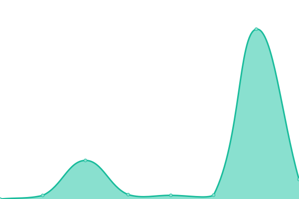

# [📈 Live Status](https://demo.upptime.js.org): <!--live status--> **🟩 All systems operational**

This repository contains the open-source uptime monitor and status page for [mh-data-science](https://demo.upptime.js.org), powered by [Upptime](https://github.com/upptime/upptime).

With [Upptime](https://upptime.js.org), you can get your own unlimited and free uptime monitor and status page, powered entirely by a GitHub repository. We use [Issues](https://github.com/mh-data-science/upptime/issues) as incident reports, [Actions](https://github.com/mh-data-science/upptime/actions) as uptime monitors, and [Pages](https://demo.upptime.js.org) for the status page.

<!--start: status pages-->
<!-- This summary is generated by Upptime (https://github.com/upptime/upptime) -->
<!-- Do not edit this manually, your changes will be overwritten -->
<!-- prettier-ignore -->
| URL | Status | History | Response Time | Uptime |
| --- | ------ | ------- | ------------- | ------ |
|  [Prod Barracuda v4 NB](https://barracuda-origin.mediahuisgroup.com/v4/nb/docs) | 🟩 Up | [prod-barracuda-v4-nb.yml](https://github.com/mh-data-science/upptime/commits/HEAD/history/prod-barracuda-v4-nb.yml) | 

 499ms
     
 | 

<a href="https://mh-data-science.github.io/upptime/history/prod-barracuda-v4-nb">100.00%</a>
    

|  [Prod Barracuda v4 TEL](https://barracuda-origin.mediahuisgroup.com/v4/tel/docs) | 🟩 Up | [prod-barracuda-v4-tel.yml](https://github.com/mh-data-science/upptime/commits/HEAD/history/prod-barracuda-v4-tel.yml) | 

 144ms
     
 | 

<a href="https://mh-data-science.github.io/upptime/history/prod-barracuda-v4-tel">100.00%</a>
    

|  [Prod Barracuda v4 INDO](https://barracuda-origin.mediahuisgroup.com/v4/indo/docs) | 🟩 Up | [prod-barracuda-v4-indo.yml](https://github.com/mh-data-science/upptime/commits/HEAD/history/prod-barracuda-v4-indo.yml) | 

 134ms
     
 | 

<a href="https://mh-data-science.github.io/upptime/history/prod-barracuda-v4-indo">100.00%</a>
    

|  [Prod Barracuda v4 VL](https://barracuda-origin.mediahuisgroup.com/v4/vl/docs) | 🟩 Up | [prod-barracuda-v4-vl.yml](https://github.com/mh-data-science/upptime/commits/HEAD/history/prod-barracuda-v4-vl.yml) | 

 140ms
     
 | 

<a href="https://mh-data-science.github.io/upptime/history/prod-barracuda-v4-vl">100.00%</a>
    

|  [Prod Barracuda v4 AZ](https://barracuda-origin.mediahuisgroup.com/v4/az/docs) | 🟩 Up | [prod-barracuda-v4-az.yml](https://github.com/mh-data-science/upptime/commits/HEAD/history/prod-barracuda-v4-az.yml) | 

 133ms
     
 | 

<a href="https://mh-data-science.github.io/upptime/history/prod-barracuda-v4-az">100.00%</a>
    

|  [Traffic Dashboard Mediahuis België](https://traffic.mediahuis.be/api/system/status) | 🟩 Up | [traffic-dashboard-mediahuis-belgie.yml](https://github.com/mh-data-science/upptime/commits/HEAD/history/traffic-dashboard-mediahuis-belgie.yml) | 

 1351ms
     
 | 

<a href="https://mh-data-science.github.io/upptime/history/traffic-dashboard-mediahuis-belgie">100.00%</a>
    

|  [Traffic Dashboard Mediahuis Nederland](https://traffic-tmg.mediahuis.nl/api/system/status) | 🟩 Up | [traffic-dashboard-mediahuis-nederland.yml](https://github.com/mh-data-science/upptime/commits/HEAD/history/traffic-dashboard-mediahuis-nederland.yml) | 

 8056ms
     
 | 

<a href="https://mh-data-science.github.io/upptime/history/traffic-dashboard-mediahuis-nederland">100.00%</a>
    

|  [Traffic Dashboard Mediahuis Ierland](https://traffic-inm.mediahuis.ie/api/system/status) | 🟩 Up | [traffic-dashboard-mediahuis-ierland.yml](https://github.com/mh-data-science/upptime/commits/HEAD/history/traffic-dashboard-mediahuis-ierland.yml) | 

 790ms
     
 | 

<a href="https://mh-data-science.github.io/upptime/history/traffic-dashboard-mediahuis-ierland">100.00%</a>
    

|  [Traffic Dashboard Mediahuis Limburg](https://traffic-lim.mediahuis.nl) | 🟩 Up | [traffic-dashboard-mediahuis-limburg.yml](https://github.com/mh-data-science/upptime/commits/HEAD/history/traffic-dashboard-mediahuis-limburg.yml) | 

 1218ms
     
 | 

<a href="https://mh-data-science.github.io/upptime/history/traffic-dashboard-mediahuis-limburg">100.00%</a>
    

|  [Traffic Dashboard NRC](https://traffic.mediahuis.nl) | 🟩 Up | [traffic-dashboard-nrc.yml](https://github.com/mh-data-science/upptime/commits/HEAD/history/traffic-dashboard-nrc.yml) | 

 1043ms
     
 | 

<a href="https://mh-data-science.github.io/upptime/history/traffic-dashboard-nrc">100.00%</a>
    

|  [Traffic Dashboard Zimmo](https://traffic-zimmo.mediahuis.be) | 🟩 Up | [traffic-dashboard-zimmo.yml](https://github.com/mh-data-science/upptime/commits/HEAD/history/traffic-dashboard-zimmo.yml) | 

 1009ms
     
 | 

<a href="https://mh-data-science.github.io/upptime/history/traffic-dashboard-zimmo">100.00%</a>
    

|  [Traffic Dashboard Mediahuis Luxemburg](https://traffic.mediahuis.lu/) | 🟩 Up | [traffic-dashboard-mediahuis-luxemburg.yml](https://github.com/mh-data-science/upptime/commits/HEAD/history/traffic-dashboard-mediahuis-luxemburg.yml) | 

 1194ms
     
 | 

<a href="https://mh-data-science.github.io/upptime/history/traffic-dashboard-mediahuis-luxemburg">100.00%</a>
    

|  [Traffic Dashboard Mediahuis Germany](https://traffic.mediahuis.de/) | 🟩 Up | [traffic-dashboard-mediahuis-germany.yml](https://github.com/mh-data-science/upptime/commits/HEAD/history/traffic-dashboard-mediahuis-germany.yml) | 

 1092ms
     
 | 

<a href="https://mh-data-science.github.io/upptime/history/traffic-dashboard-mediahuis-germany">100.00%</a>
    

<!--end: status pages-->

[**Visit our status website →**](https://demo.upptime.js.org)

## 📄 License

- Powered by: [Upptime](https://github.com/upptime/upptime)
- Code: [MIT](./LICENSE) © [mh-data-science](https://demo.upptime.js.org)
- Data in the `./history` directory: [Open Database License](https://opendatacommons.org/licenses/odbl/1-0/)
